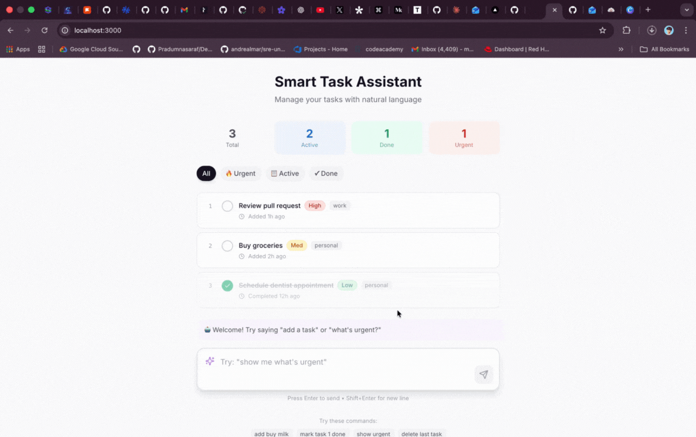

# 🤖 Smart Task Assistant

> A beginner-friendly demo showcasing A2UI framework concepts with a natural language task manager powered by Claude.



## 📋 What We're Building

This project demonstrates how to build an **AI-powered task manager** that understands natural language commands. Instead of clicking buttons to add tasks, users simply type things like:

- "add buy groceries as high priority"
- "mark task 2 as complete"  
- "show me what's urgent"
- "delete the last task"

### Why This Example?

Most AI demos are chat interfaces. But real applications need AI to *do things*, not just talk. This demo shows the **A2UI philosophy**: AI agents that drive user interfaces through actions, not just conversations.

**Key Concepts Demonstrated:**
- 🧠 **Agent-Driven UI**: Claude interprets user intent and executes actions
- 🛠 **Tool-Based Architecture**: Defined tools for add, complete, delete, filter
- 🔄 **State Management**: Immutable state updates from agent responses
- 🎨 **Modern React**: Next.js 14 App Router with TypeScript

---

## 🚀 Quick Start

### Prerequisites

Before you begin, make sure you have:
- [Node.js](https://nodejs.org/) v18 or later
- [npm](https://www.npmjs.com/) v9 or later
- An [Anthropic API Key](https://console.anthropic.com/settings/keys)

### Setup

1. **Clone or copy this project**
   ```bash
   cd smart-task-assistant
   ```

2. **Install dependencies**
   ```bash
   npm install
   ```

3. **Configure your API key**
   ```bash
   # Copy the example env file
   cp .env.example .env.local
   
   # Edit .env.local and add your Anthropic API key
   # ANTHROPIC_API_KEY=sk-ant-...
   ```

4. **Start the development server**
   ```bash
   npm run dev
   ```

5. **Open the app**
   Navigate to [http://localhost:3000](http://localhost:3000)

That's it! Try typing "add my first task" to get started.

---

## 🧠 A2UI Core Concepts

### The "Aha!" Moments

**1. Natural Language → Structured Actions**

When you type "add buy groceryies as urgent", the system:
1. Sends your text to Claude
2. Claude identifies the intent (add_task)
3. Claude extracts structured data (title: "buy groceries", priority: "high")
4. Our code executes the action
5. UI updates to show the new task

```
User Input → LLM Reasoning → Tool Call → State Update → UI Render
```

**2. Tools, Not Chat**

Instead of Claude generating text responses, it uses **tools**:

```typescript
{
  name: 'add_task',
  input: {
    title: 'buy groceries',
    priority: 'high',
    category: 'personal'
  }
}
```

This is more reliable than parsing free-form text responses.

**3. Declarative State**

The agent returns *what changed*, and React handles *how to render it*:

```typescript
// Agent returns updated state
{
  tasks: [...previousTasks, newTask],
  agentMessage: 'Added "buy groceries"'
}

// React renders the diff automatically
```

### Architecture Overview

```
┌─────────────────────────────────────────────────────────────┐
│                     FRONTEND (React)                        │
│                                                             │
│  ┌─────────────┐    ┌──────────────┐    ┌──────────────┐  │
│  │ InputArea   │───▶│ TaskAgent    │───▶│ TaskUI       │  │
│  │ (NL input)  │    │ (state mgmt) │    │ (display)    │  │
│  └─────────────┘    └──────────────┘    └──────────────┘  │
│                            │                                │
└────────────────────────────┼────────────────────────────────┘
                             │
                             ▼
┌─────────────────────────────────────────────────────────────┐
│                     BACKEND (API Route)                     │
│                                                             │
│  ┌─────────────┐    ┌──────────────┐    ┌──────────────┐  │
│  │ /api/agent  │───▶│ Claude API   │───▶│ Tool Handler │  │
│  │             │    │ (reasoning)  │    │ (execution)  │  │
│  └─────────────┘    └──────────────┘    └──────────────┘  │
│                                                             │
└─────────────────────────────────────────────────────────────┘
```

---

## 🔧 Extending This Example

### Ideas for Customization

1. **Add Due Dates**
   - Add a `dueDate` field to tasks
   - Create a `set_due_date` tool
   - Support "remind me tomorrow" type commands

2. **Persistence**
   - Save tasks to localStorage for persistence
   - Or connect to a real database (Supabase, PlanetScale)

3. **Dark Mode**
   - The CSS has placeholder for dark mode
   - Add a toggle with `next-themes`

4. **Voice Input**
   - Use the Web Speech API
   - Let users speak their commands

5. **Undo/Redo**
   - Keep a history stack
   - Add an `undo_last_action` tool

### Adding a New Tool

1. **Define the tool** in `src/lib/agent-tools.ts`:
   ```typescript
   {
     name: 'set_due_date',
     description: 'Set a due date for a task',
     input_schema: {
       properties: {
         taskIdentifier: { type: 'string' },
         dueDate: { type: 'string', description: 'ISO date string' }
       }
     }
   }
   ```

2. **Add the handler** in `src/app/api/agent/route.ts`:
   ```typescript
   case 'set_due_date': {
     const { taskIdentifier, dueDate } = input;
     // ... implementation
   }
   ```

3. **Update types** in `src/lib/types.ts` if needed

---

## 🐛 Troubleshooting

### Check API Key

```bash
# In your terminal, verify the key is set
cat .env.local | grep ANTHROPIC

# Should show: ANTHROPIC_API_KEY=sk-ant-...
```

### View Server Logs

```bash
# The dev server shows Claude's responses
npm run dev

# Look for lines like:
# [Agent] User message: add a task
# [Agent] Claude response: { ... }
```

---

## 📚 Learn More

- [A2UI Protocol Documentation](https://a2ui.org)
- [Anthropic API Reference](https://docs.anthropic.com/en/api)
- [Next.js Documentation](https://nextjs.org/docs)
- [Tailwind CSS](https://tailwindcss.com/docs)

---

## 🤝 Contributing

This is a demo project, but improvements are welcome! Ideas:
- Better error messages
- More example commands
- Accessibility improvements

---

## 📄 License

MIT License - feel free to use this as a starting point for your own projects!

---

Built with ❤️ by ThatDevOpsGuy
